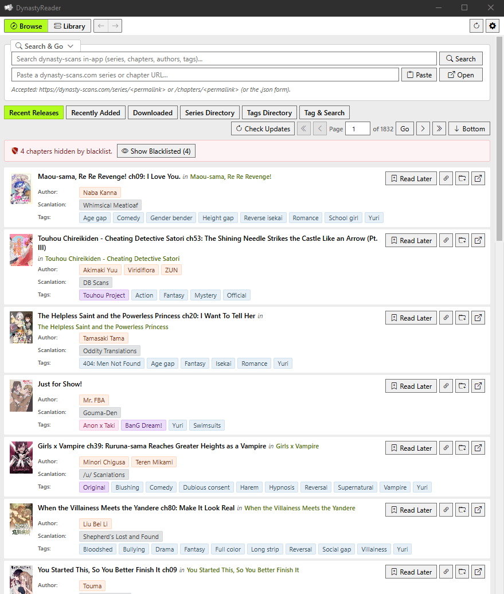
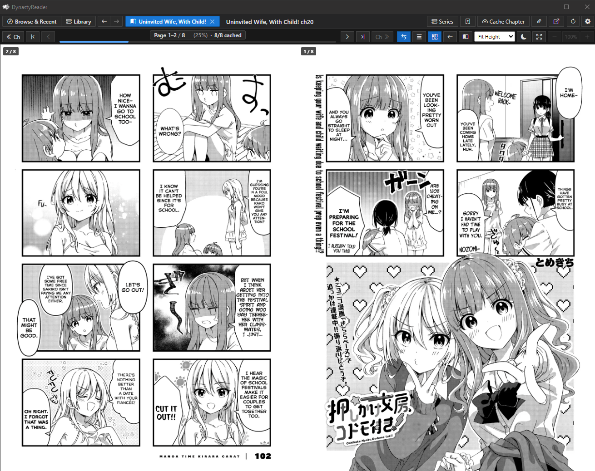

# DynastyReader: Unofficial Dynasty Scans Client (Desktop & Android)

DynastyReader is a fast, lightweight, unofficial reader for [Dynasty Scans](https://dynasty-scans.com/), built with Rust, Tauri v2, and SolidJS. It runs natively across **Windows**, **Linux**, and **Android**. It stores metadata, reading progress, custom collections, and downloaded chapters locally in SQLite, using conditional ETag caching to keep upstream server requests minimal.

- [DynastyReader: Unofficial Dynasty Scans Client (Desktop \& Android)](#dynastyreader-unofficial-dynasty-scans-client-desktop--android)
  - [1. Overview \& Design Goals](#1-overview--design-goals)
  - [2. Tech Stack](#2-tech-stack)
  - [3. Features](#3-features)
  - [5. Data Storage \& Layout](#5-data-storage--layout)
  - [6. Build \& Setup](#6-build--setup)
  - [7. LLM Attribution](#7-llm-attribution)
  - [8. License](#8-license)

<div align="center">
  
</div>

## 1. Overview & Design Goals

DynastyReader was extracted from [Project Curator](https://github.com/FuouM/Project-Curator) into a standalone desktop application with a few specific design priorities:

- **Low Server Impact**: Uses conditional HTTP requests (`If-None-Match` / `ETag`) and connection pooling to avoid re-downloading unchanged metadata. Mass scraping and bulk chapter downloader features are intentionally omitted.
- **Local & Anonymous**: No accounts or logins. Bookmarks, history, subscriptions, custom collections, and cached metadata stay on your local machine.
- **Self-Contained & Portable**: Configuration, database files, covers, and cached pages live in a single `.data/` folder next to the executable.
- **Offline Reading**: Individual chapters can be cached for offline viewing, with page-level progress saved locally.
- **Reactive Desktop Performance**: Fine-grained reactive SolidJS frontend coupled with an asynchronous Rust backend, supporting slot window virtualization, zero-flicker cover hydration, and smooth scrolling.

| Browse | Reader |
|:-:|:-:|
|  |  |

## 2. Tech Stack

- **Backend / Runtime**: Rust (2021 edition), Tauri v2, Tokio async runtime
- **HTTP Client**: Reqwest (`rustls-tls`, HTTP/2 connection pooling)
- **Database**: SQLite 3 via `rusqlite` (bundled, WAL mode, foreign keys, connection pooling, online backup)
- **Image Engine**: `image` crate (WebP transcoding, SIMD/accelerated JPEG/PNG decoders)
- **Frontend**: TypeScript, Vite 6, SolidJS (reactive signals and stores), WinForms control styling (`curator-ui-base.css`)
- **Icons**: Bootstrap Icons font

## 3. Features

### 3.1. High-Performance Reader

- **Flexible Reading Modes**: Single-Page, Continuous Vertical Scroll, and Dual-Page Spread (RTL/LTR with first-page cover offset).
- **Smart Webtoon Handling**: Automatically detects long-strip chapters to suppress spread mode and enforce fit-to-width.
- **Rendering & Physics**: Slot window virtualization for massive chapters, $O(\log N)$ binary search scroll tracking, smooth wheel animation easing, and stationary tabular progress counters.
- **Exact Resumption & Offline Pages**: Saves page-level progress and completion to SQLite on turn; supports chapter prefetching and offline storage.

### 3.2. Library & Custom Collections

- **Reactive Four-Panel Hub**: Followed Series (with unread indicators), Custom Collections/Favorites, Bookmarks, and timestamped Reading History.
- **Collection Management**: Create, rename, and organize user-defined collections with series or chapter entries via modal dialogs.
- **Instant State Sync**: Reactive SolidJS state refreshes all library views immediately upon mutation without reloads.

### 3.3. Browse, Search & Metadata Caching

- **Sub-Tab Navigation**: Recent Releases, Recently Added, Downloaded, Series Directory, and Tags Directory.
- **Search & Go**: Collapsible header with category-filtered Typeahead search and direct Dynasty URL pasting.
- **Low-Impact Caching**: Stale-while-revalidate (SWR) caching with `If-None-Match` / `ETag` validation and real-time lifetime bandwidth diagnostics.
- **Zero-Flicker Cover Hydration**: Reactive image cache with memory store and placeholder hydration to prevent layout shifts.

### 3.4. Storage & Database Management

- **Granular Cache Inspection**: Disk footprint overview, per-series chapter breakdown, and one-click purge tools for scans and covers.
- **SQLite Database Utilities**: Live table row statistics, online SQLite database backup creation, restoration from file with validation, and database wipe.

### 3.5. Customization, Shell & Maintenance

- **Tag Taxonomy & Blacklist**: Categorized tags (Author, Scanlator, Pairing, Doujin, Series, etc.) with customizable Hide or Trigger-Warning overlay modes.
- **Theming & Scaling**: Full Dark, Light, and System themes with dynamic UI scaling from 50% to 200%.
- **Custom Keyboard Shortcuts**: Interactive shortcut manager with key combination recording and conflict detection.
- **Responsive Mobile Shell**: Adaptive layout with compact topbar, segmented bottom navigation bar, mobile 4px overlay scrollbars, touch overscroll containment, and collapsible reader controls drawer.
- **Touch & Gesture Navigation**: Seamless swipe overscroll with haptic feedback for previous/next chapter transitions, customizable tap zones, and edge swipe boundary safety.
- **In-App Updates & Logs**: Automated GitHub release SemVer update checker with direct binary replacement on Windows, plus one-click access to application logs.

## 5. Data Storage & Layout

All application data is stored in the `.data/` folder next to the executable:

```text
.data/
├── dynasty_reader.db       # SQLite database (history, bookmarks, subscriptions, progress, blacklists, collections)
├── covers/                 # Cached series and chapter covers (.webp)
├── pages/                  # Downloaded offline chapter pages
│   └── <series_slug>/
│       └── <chapter_slug>/
│           ├── page_0001.jpg
│           ├── page_0002.jpg
│           └── ...
└── logs/
    └── dynasty-reader.log  # Application rolling logs
```

## 6. Build & Setup

### 6.1. Prerequisites

- **Node.js**: >= 20.x and `npm`
- **Rust**: `stable-x86_64-pc-windows-msvc` (Cargo >= 1.80)
- **sccache** *(Optional)*: Automatically used for build caching if present in `.rust/.cargo/bin/sccache.exe`.

### 6.2. Optional: Isolated Toolchain Setup (Windows)

To bootstrap a local, portable Rust environment inside the project folder without system-wide changes:

```powershell
.\setup_env.ps1
```

### 6.3. Development

```powershell
# 1. Load the local toolchain environment (skip if using system Rust)
. .\env.ps1

# 2. Start Vite + Tauri dev mode
.\dev.ps1
```

### 6.4. Desktop Release Build

To build and assemble the standalone portable distribution for Windows:

```powershell
# Build and stage to portable/ directory
.\build_release_portable.ps1

# Optional: also package as a .zip archive
.\build_release_portable.ps1 -Zip
```

The output standalone folder will be staged at `portable/DynastyReader.exe`. Copy `DynastyReader.exe` to any folder; it will initialize the `.data/` directory automatically on launch.

### 6.5. Android Build

To build the Android APK locally:

```powershell
# Build and stage release APK (Target: aarch64)
.\build_android.ps1 -Release

# Start interactive Android dev mode with live reload
.\build_android.ps1 -Dev
```

Generated APKs will be located at:

```text
src-tauri/gen/android/app/build/outputs/apk/
```

### 6.6. Automated CI/CD Releases

GitHub Actions automatically builds and publishes release binaries for all supported platforms whenever a version tag (`v*`) is pushed:

- **Windows**: Portable standalone executable (`DynastyReader.exe`)
- **Linux**: Universal AppImage (`DynastyReader-x86_64.AppImage`) and Debian package (`.deb`)
- **Android**: Native ARM64 APK (`DynastyReader-arm64-v8a-release.apk`), Universal APK (`DynastyReader-universal-release.apk`), and Google Play Bundle (`.aab`)

## 7. LLM Attribution

Development assistance provided by:

- Gemini 3.5, 3.6, and 3.7
- DeepSeek V4 Flash 0731

## 8. License

Distributed under the MIT License. See `LICENSE` for details.  

*DynastyReader is an independent open-source project and is not affiliated with Dynasty Scans.*

> Yuri shall conquer the earth!
