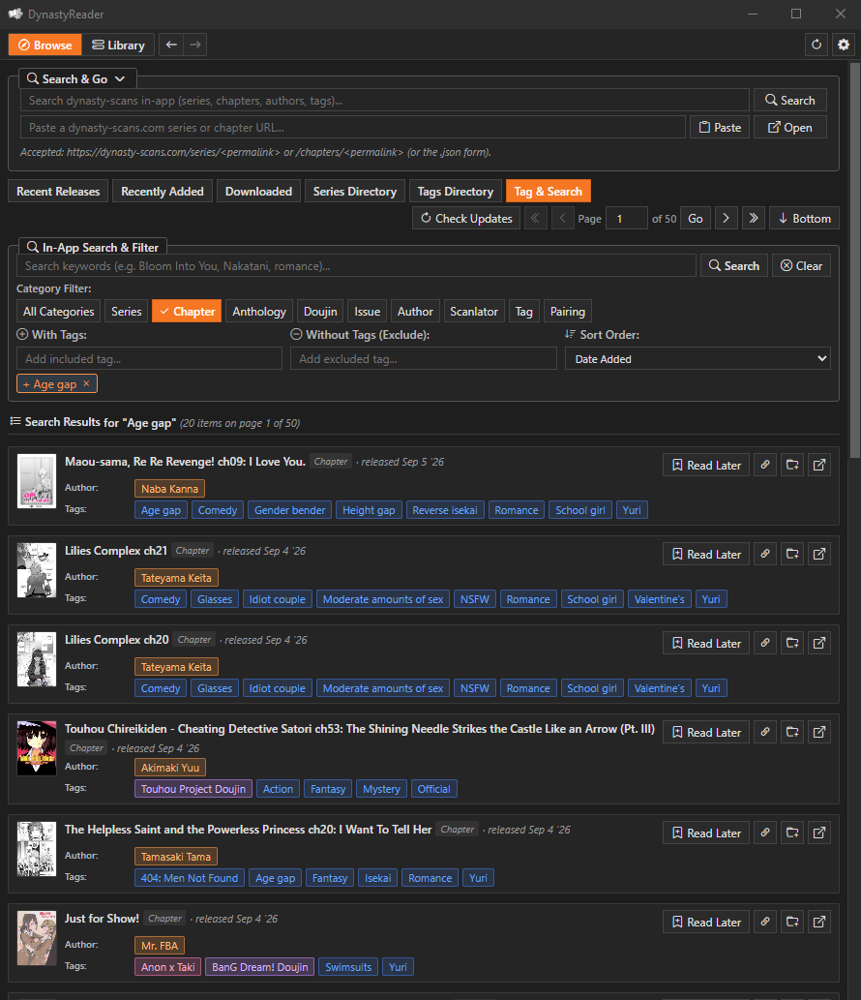
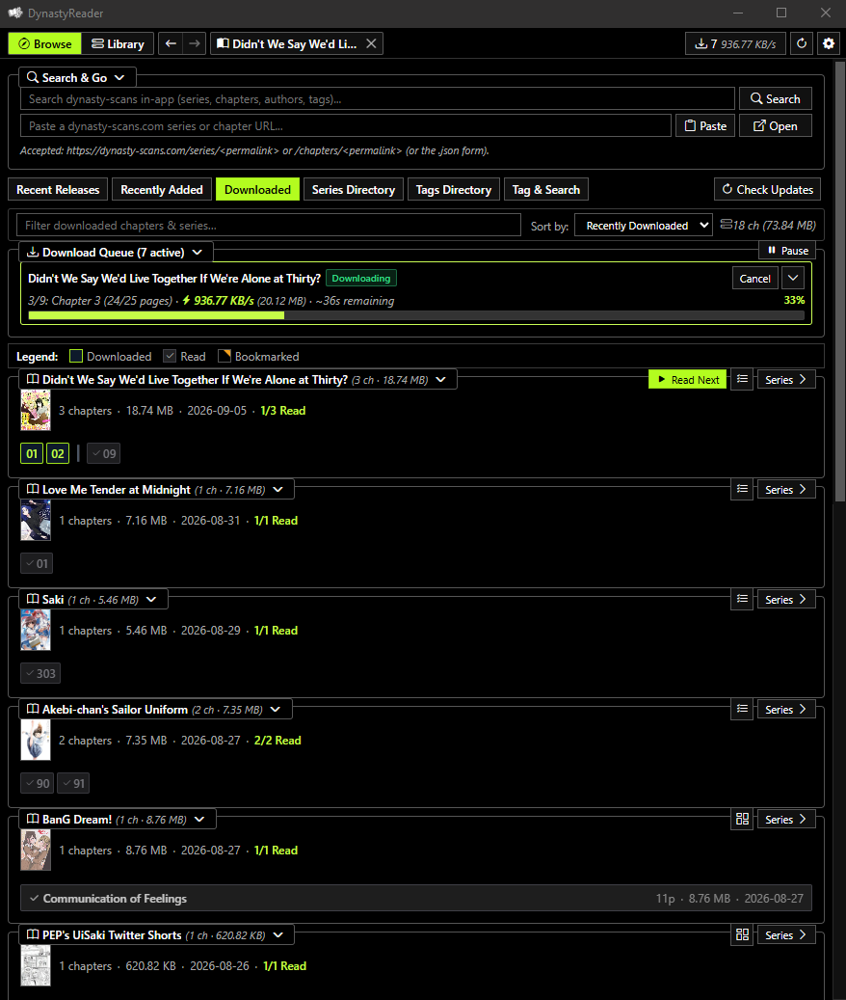
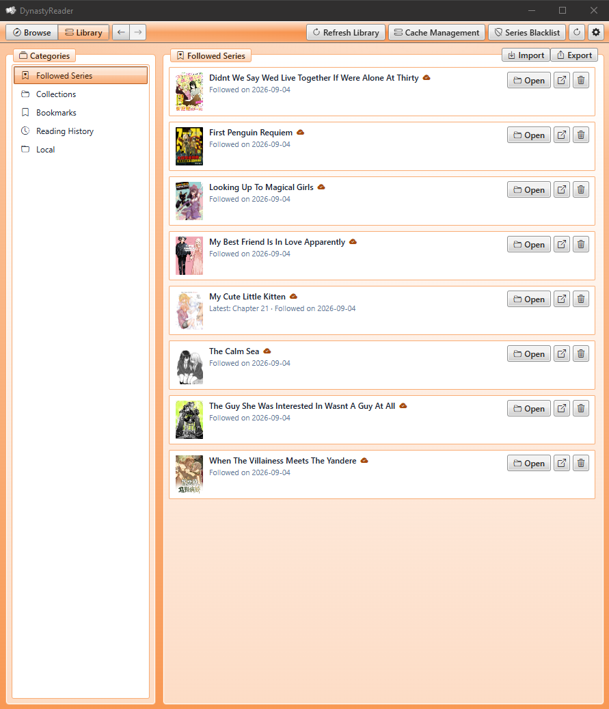
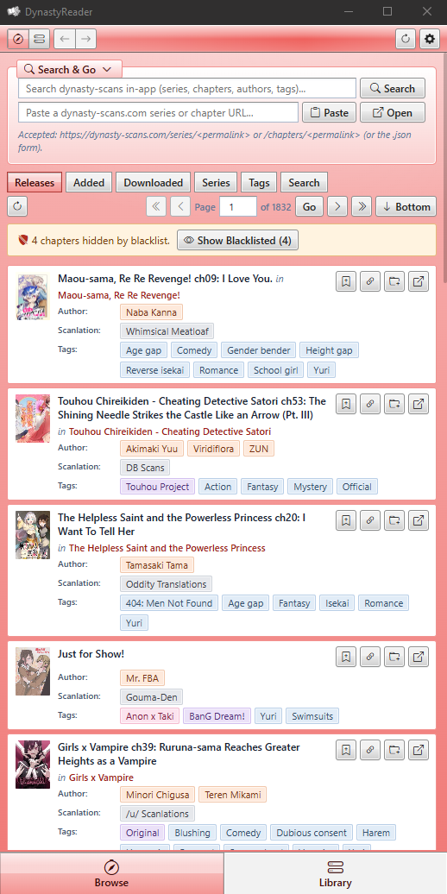
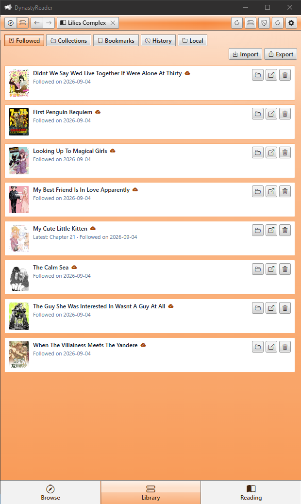

# DynastyReader: Unofficial Dynasty Scans Client (Desktop & Android)

DynastyReader is a fast, lightweight, unofficial reader for [Dynasty Scans](https://dynasty-scans.com/), built with Rust, Tauri v2, and SolidJS. It runs natively across **Windows**, **Linux**, and **Android**. It stores metadata, reading progress, custom collections, and downloaded chapters locally in SQLite, using conditional ETag caching to keep upstream server requests minimal.

<div align="center">
  
</div>

- [DynastyReader: Unofficial Dynasty Scans Client (Desktop \& Android)](#dynastyreader-unofficial-dynasty-scans-client-desktop--android)
  - [1. Overview \& Design Goals](#1-overview--design-goals)
  - [2. Platform Compatibility \& Tested Environments](#2-platform-compatibility--tested-environments)
  - [3. Tech Stack](#3-tech-stack)
  - [4. Features](#4-features)
  - [5. Roadmap](#5-roadmap)
  - [6. Data Storage \& Layout](#6-data-storage--layout)
  - [7. Build \& Setup](#7-build--setup)
  - [8. LLM Attribution](#8-llm-attribution)
  - [9. License](#9-license)

---

## 1. Overview & Design Goals

DynastyReader was extracted from [Project Curator](https://github.com/FuouM/Project-Curator) into a standalone application with specific design priorities:

- **Low Server Impact**: Uses conditional HTTP requests (`If-None-Match` / `ETag`) and connection pooling to avoid re-downloading unchanged metadata. Mass scraping and aggressive bulk downloaders are intentionally omitted to respect upstream infrastructure.
- **Local & Anonymous**: No accounts, logins, or telemetry. Bookmarks, reading history, subscriptions, custom collections, and cached metadata stay on your local device.
- **Self-Contained & Portable**: Desktop configuration, SQLite database files, covers, downloaded chapters, and local imports live inside a single portable `.data/` folder next to the executable.
- **Offline Reading & Local Imports**: Read downloaded chapters on the go, or import external `.cbz` archives and local image folders directly into your personal library.
- **Reactive Performance**: Fine-grained reactive SolidJS frontend coupled with an asynchronous Rust backend, supporting slot window virtualization, zero-flicker cover hydration, smooth wheel animations, and low memory overhead.

| Browse | Search |
|:---:|:---:|
|  |  |
| Downloads | Library |
|  |  |

| Reader Spread | Reader Scroll - Long Strip |
|:---:|:---:|
|  |  |

| Mobile - Browse | Mobile - Library |
|:---:|:---:|
|  |  |

---

## 2. Platform Compatibility & Tested Environments

DynastyReader targets desktop and mobile platforms, but has been verified specifically on the following environments:

- **Windows**: Tested and verified on **Windows 10 (x86_64)**.
- **Android**: Tested and actively daily-driven on real phone hardware (**Android 16**), alongside emulator testing on **Android 17** (Pixel 9).
- **Linux**: Tested on **Ubuntu via WSL2**; standalone universal **AppImage** and **Debian (`.deb`)** packages are automatically compiled and published through GitHub Actions CI.

---

## 3. Tech Stack

- **Backend / Runtime**: Rust (2021 edition), Tauri v2, Tokio async runtime, Mimalloc global allocator
- **HTTP Client**: Reqwest (`rustls-tls` with `webpki-roots` for pure-Rust TLS across platforms, HTTP/2 connection pooling, ETag revalidation)
- **Database**: SQLite 3 via `rusqlite` (bundled, WAL mode, pooled connections, online backup, native SQLite authorizer)
- **Image Engine**: `image` crate (WebP transcoding, accelerated decoders) and `webp`
- **Frontend**: TypeScript, Vite 6, SolidJS (fine-grained reactive signals and stores)
- **Styling**: Modular CSS design with classic desktop WinForms / retro Aero and modern Flat Dark, Light, and High-Contrast themes, alongside customizable accent color presets
- **Haptics & Touch**: Native platform haptic vibration engine and touch overscroll physics
- **Icons**: Bootstrap Icons font

---

## 4. Features

### 4.1. High-Performance Reader

- **Flexible Reading Modes**: Single-Page, Continuous Vertical Scroll, and Dual-Page Spread (LTR / RTL with first-page cover offset toggle).
- **Scroll Lock Mode**: Optional discrete page-by-page stepping in vertical continuous scroll mode, utilizing symmetric zero-boundary `easeInOutQuad` transitions to eliminate initial jerk and overshoot.
- **Mobile Landscape Overrides**: Configurable automatic orientation switching to toggle Paged or Spread layout and Fit-Height when rotating mobile devices into landscape.
- **Dynamic Zoom & Pan**: Fluid pinch-to-zoom across all fit modes on touchscreens, with double-tap zoom reset.
- **Real-Time Image Filters**: Popover controls for brightness, contrast, grayscale, and sepia adjustments.
- **Touch & Gesture Navigation**: Smooth drag pull-overscroll chapter transitions with configurable haptic feedback and spring physics, edge swipe boundary safety, and customizable tap zones with an interactive layout guide.
- **Smart Webtoon Handling**: Automatically detects long-strip chapters to suppress dual-page spread mode and enforce fit-to-width.
- **Keyboard Navigation & Hotkeys**: Full custom shortcut manager with key combination recording; Vim keybindings (`h`/`j`/`k`/`l`), percentage-based page jumps (`0`–`9`), and a quick page jump dialog.
- **Exact Resumption & Offline Pages**: Saves page-level progress and completion to SQLite on turn; supports chapter prefetching and offline storage. Android status bar hiding is supported for distraction-free reading.

### 4.2. Library, Custom Collections & Local Imports

- **Five-Panel Hub**: Followed Series (with unread release indicators), Custom Collections / Favorites, Bookmarks, timestamped Reading History, and Local Imports.
- **Local CBZ & Folder Import**: Import and read local manga chapters or volumes directly from `.cbz` / `.zip` archives or image directories; edit local series metadata with cover extraction and file preview.
- **Collection Management**: Create, rename, and organize user-defined collections with series or individual chapter entries.
- **Backup & Transfer**: Export and import followed series and collections to and from copiable JSON or clipboard text, with selectable single or multi-collection scoping.
- **Batch Management**: Search and filter library panes locally; bulk clear support for reading history and bookmarks.
- **Instant State Sync**: Reactive SolidJS state refreshes all library views immediately upon mutation without full view reloads.

### 4.3. Browse, Search & Metadata Caching

- **Sub-Tab Navigation**: Recent Releases, Recently Added, Downloaded, Series Directory, Tags Directory, and Search.
- **Search & Go**: Collapsible header with category-filtered Typeahead search, tag autocompletion, and direct Dynasty Scans URL pasting.
- **Low-Impact SWR Caching**: Stale-while-revalidate caching with `If-None-Match` / `ETag` validation, live lifetime bandwidth saved statistics, and session traffic monitoring.
- **Zero-Flicker Cover Hydration**: Reactive image cache with memory store and placeholder hydration to prevent layout shifts.

### 4.4. Download Manager & Cache Governance

- **Dedicated Download Manager**: Queue management with pause, resume, per-chapter cancel/retry, real-time speed meter, ETA estimation, and session bandwidth tracking.
- **Network & Scheduling Constraints**: Wi-Fi-only download enforcement (ideal for mobile metered connections) and configurable scheduled download time windows.
- **Automatic Cache Ceiling & LRU Pruning**: Set a maximum disk storage ceiling for cached chapters with automatic LRU (Least Recently Used) pruning of already-read chapters.
- **Granular Storage Overview**: Disk footprint inspection by series, orphan chapter detection, and one-click purge tools.
- **SQLite Database Utilities**: Live table row statistics, online SQLite database backup creation, restoration from file with schema validation, and database wipe.

### 4.5. Customization, Shell & Accessibility

- **Tag Taxonomy & Blacklist**: Categorized tags (Author, Scanlator, Pairing, Doujin, Series, etc.) with customizable Hide or Trigger-Warning overlay modes.
- **Theming & Accents**: Full Dark, Light, High-Contrast, and classic Aero themes, complemented by customizable accent color presets (Slate, Crimson, Forest, Violet, Amber, Rose, Cyan).
- **Fluid UI Scaling**: Global UI scaling from 50% to 200% across desktop and mobile, with decoupled manga viewport sizing.
- **Custom Keyboard Shortcuts**: Interactive shortcut manager with key combination recording and conflict detection.
- **Responsive Mobile Shell**: Adaptive layout with compact topbar, segmented bottom navigation bar, mobile 4px overlay scrollbars, touch overscroll containment, and collapsible reader controls drawer.
- **Haptic Engine Settings**: Dedicated haptic feedback configuration with adjustable vibration durations and live pattern previews for taps, page turns, chapter snaps, and confirmations.
- **In-App Updates & Logs**: Automated GitHub release SemVer update checker with direct binary replacement on Windows, plus one-click access to application logs.

---

## 5. Roadmap

The current roadmap focuses on stability, real-world reliability, and thoughtful distribution:

- **Personal Daily Driving & Dogfooding**: The author actively uses DynastyReader as their daily manga reader across Windows 10 and Android, ensuring practical ergonomics, battery efficiency, and smooth touch physics.
- **Continual Bug Fixes & Refinements**: Maintaining stability and addressing edge cases, regressions, or upstream website changes as they are discovered during daily use.
- **Milestone v1.0.0**: Keeping the application stable in the `v0.x` series until personal daily use proves it is thoroughly polished and rock-solid, at which point the version will be bumped to `v1.0.0`.
- **F-Droid & Package Distribution**: Once v1.0.0 is released, packaging and submitting DynastyReader to **F-Droid** (and exploring other community package repositories) for streamlined Android distribution, in addition to standalone GitHub releases.

---

## 6. Data Storage & Layout

On desktop platforms, all application data is stored in a self-contained `.data/` folder located next to the executable (on Android, standard sandboxed application storage is used):

```text
.data/
├── dynasty_reader.db               # SQLite database (history, bookmarks, subscriptions, progress, blacklists, collections)
├── dynasty_reader.backup.<ts>.db   # Optional online database backups
├── covers/                         # Cached series and chapter covers (.webp)
├── pages/                          # Downloaded offline chapter pages
│   └── <series_slug>/
│       └── <chapter_slug>/
│           ├── page_0001.jpg
│           ├── page_0002.jpg
│           └── ...
├── local/                          # Local manga unpacked from CBZ archives or image folders
│   └── <series_slug>/
│       └── chapters/
│           └── <chapter_slug>/
│               ├── p000.jpg
│               └── ...
└── logs/
    └── dynasty-reader.log          # Application rolling logs
```

---

## 7. Build & Setup

### 7.1. Prerequisites

- **Node.js**: >= 20.x and `npm`
- **Rust**: `stable-x86_64-pc-windows-msvc` (Cargo >= 1.80) or platform equivalent
- **sccache** *(Optional)*: Automatically used for build caching if present in `.rust/.cargo/bin/sccache.exe`.

### 7.2. Optional: Isolated Toolchain Setup (Windows)

To bootstrap a local, portable Rust environment inside the project folder without system-wide changes:

```powershell
.\setup_env.ps1
```

### 7.3. Development

```powershell
# 1. Load the local toolchain environment (skip if using system Rust)
. .\env.ps1

# 2. Start Vite + Tauri dev mode
.\dev.ps1
```

### 7.4. Desktop Release Build

To build and assemble the standalone portable distribution for Windows:

```powershell
# Build and stage to portable/ directory
.\build_release_portable.ps1

# Optional: also package as a .zip archive
.\build_release_portable.ps1 -Zip
```

The output standalone executable will be staged at `portable/DynastyReader.exe`. Copy `DynastyReader.exe` to any folder; it will initialize the `.data/` directory automatically on launch.

### 7.5. Android Build

To build the Android APK locally:

```powershell
# Build and stage release APK (Target: aarch64)
.\build_android.ps1 -Release

# Start interactive Android dev mode with live reload
.\build_android.ps1 -Dev
```

Generated APKs will be located at:

```text
src-tauri/gen/android/app/build/outputs/apk/
```

### 7.6. Automated CI/CD Releases

GitHub Actions automatically builds and publishes release binaries for all supported platforms whenever a version tag (`v*`) is pushed:

- **Windows**: Portable standalone executable (`DynastyReader.exe`)
- **Linux**: Universal AppImage (`DynastyReader-x86_64.AppImage`) and Debian package (`.deb`)
- **Android**: Native ARM64 APK (`DynastyReader-arm64-v8a-release.apk`), Universal APK (`DynastyReader-universal-release.apk`), and Google Play Bundle (`.aab`)

---

## 8. LLM Attribution

Development assistance provided by:

- Gemini 3.5, 3.6, 3.7, and 3.8
- DeepSeek V4 Flash 0731

---

## 9. License

Distributed under the MIT License. See `LICENSE` for details.  

*DynastyReader is an independent open-source project and is not affiliated with Dynasty Scans.*

> Yuri shall conquer the earth!
